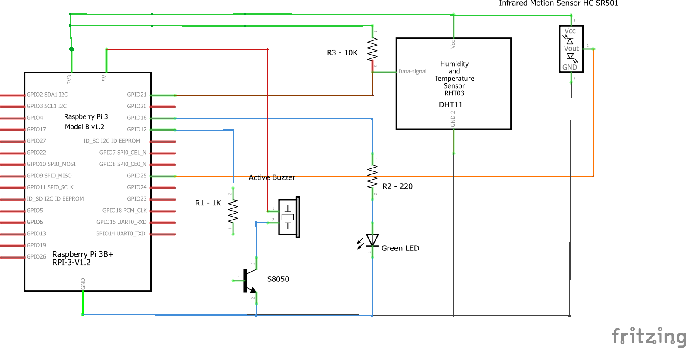

# Circuit Kiosk

Circuit Kiosk is a [Circuit](https://www.circuit.com/) application that showcases the portability of the Circuit SDK and the unlimited potential of combining inexpensive hardware with a powerful platform to build all kind of communication devices.
This application allows offices without human receptionist to greet visitors and communicate them with people inside the office using video. People inside the office will then be able to unlock the door.
Learn more and join the [Circuit Development Community](https://circuit.github.io/)

## What you will need
* A Raspberry PI (RPI 3B was used here)
* A micro SD card (16GB preferred)
* A 7" touch screen display (Alternatively a HDMI Monitor and Cable, and Mouse)
* A USB Keyboard (Only needed for initial setup)
* A set of speakers and a microphone
* The Raspberry camera module (A USB Webcam can alternatively be used)
* A protoboard and some electronic components which are listed in another section down below

## Setting up your Raspberry PI

### Install Raspbian on the micro SD card
The easiest way is to flash the micro SD card with the Raspian Stretch with desktop and recommended software.
The ZIP file can be download from [raspberry.org](https://www.raspberrypi.org/downloads/raspbian/)
I used Balena Etcher to flash the micro SD card. You can download Etcher for your OS from [balena.io](https://www.balena.io/etcher/)

Alternatively you may installed Raspian using NOOBS following instructions on [Raspberry official site](https://projects.raspberrypi.org/en/projects/noobs-install)

### Continue setup...
Pulg the keyboard to a USB port. Insert the micro SD card into the Raspberry and connect the 7" touch screen cable. Power them both and follow instructions on the screen. (If you do not have a Raspberry touch screen just use an HDMI monitor, and USB mouse).
Follow instructions to setup the Raspberry and update software.

### Enable Camera (if RPI camera module will be installed), SSH and optionally VNC
Navigate to Main Menu->Preferences->Raspberry PI Configuration->Interfaces and enable Camera, SSH, VNC

Now you can SSH from your own computer to the RPI.

### Get the latest updates

On your Raspberry console:

    sudo apt-get update  

## Share Raspberry Pi file system with windows using samba (Optional)

Follow instructions [here](https://raspberrypihq.com/how-to-share-a-folder-with-a-windows-computer-from-a-raspberry-pi/)

## Install VNC software (Optional)

On your Raspberry console:

    sudo apt-get install realvnc-vnc-server realvnc-vnc-viewer

### Configure and Test Audio Devices

On your Raspberry console:
    
1.  Find your recording and playback devices  
  *  Locate your microphone in the list of capture hardware devices. Write down the card number and device number.  
  
         arecord -l  

  *  Locate your speaker in the list of playback hardware devices. Write down the card number and device number. Note that the 3.5mm-jack is typically labeled Analog or bcm2835 ALSA (not bcm2835 IEC958/HDMI).  
   
         aplay -l  

2.  Create a new file named .asoundrc in the home directory (/home/pi). Make sure it has the right slave definitions for microphone and speaker; use the configuration below but replace <card number> and <device number> with the numbers you wrote down in the previous step. Do this for both pcm.mic and pcm.speaker.  
    
        pcm.!default {
          type asym
          capture.pcm "mic"
          playback.pcm "speaker"
        }
        pcm.mic {
          type plug
          slave {
            pcm "hw:<card number>,<device number>"
          }
        }
        pcm.speaker {
          type plug
          slave {
            pcm "hw:<card number>,<device number>"
          }
        }
    
3.  Verify that recording and playback work:  

  *  Adjust playback volume  
  
         alsamixer

You may also adjust the recording level runnig alsamixer with the mic card number

         alsamixer -c <Card Number>
    
Press the up and down arrow to set the the desired levels
   
  *  Play test sound. Press Ctrl-C when done. If you do not hear anything check your speaker or headset connections.
  
         speaker-test -t wav
    
  If you still do not hear anything and you have an HDMI monitor connected you need to force the audio output to your speakers or headset. Do the following:
    
       sudo raspi-config
    
  Go to "Advance Options-> Audio" and select "Force 3.5mm ('headphone') jack
  
  *  Record some audio
  
         arecord --format=S16_LE --duration=5 --rate=16000 --file-type=raw out.raw
      
  *  Check the recording by replaying it
  
         aplay --format=S16_LE --rate=16000 out.raw
      
## Install node and npm
We need a later version than the one in the raspian repo. So we will download from nodejs.org

         wget https://nodejs.org/dist/v11.6.0/node-v11.6.0-linux-armv6l.tar.xz
         tar -xzf node-v11.6.0-linux-armv6l.tar.xz
         cd node-v11.6.0-linux-armv6l
         sudo cp -R * /usr/local

Verify everything is installed OK

          node -v
          npm -v

## Install and build bcm2835 library
This C library for Raspberry Pi provides access to GPIO and other IO functions on the Broadcom BCM 2835 chip.

         wget http://www.airspayce.com/mikem/bcm2835/bcm2835-1.58.tar.gz
         tar zxvf bcm2835-1.58.tar.gz
         cd bcm2835-1.xx
         ./configure
         make
         sudo make check
         sudo make install

## Setup the application
### Clone this repo, install and rebuild for electron
        git clone https://github.com/wdmartins/circuitKiosk.git
        npm install

### Always run electron-rebuild after npm install
    ./node_modules/.bin/electron-rebuild .
This may take a long time the first time.

### [Register an account](https://www.circuit.com/web/developers/registration) on circuitsandbox.net
  
###  [Register a bot](https://circuit.github.io/oauth) on the sandbox (OAuth 2.0 Client Credentials)
  
###  Create the config.json file  
  
          cp config.template.json config.json
  
###  Edit config.json file and complete all fields accordingly

### (Optional) Use speech-to-text option to search for users
#### Setup GCS
Google Cloud Speech API is used to obtain audio transcriptions. Refer to https://cloud.google.com/speech/docs/quickstart
to setup an account, billing and get your application credentials. Then set the path to your credentials JSON file in config.json

### Install dependencies for Speech Recording (SOX)
    
    sudo apt-get install sox libsox-fmt-all

### (Optional) Enhance the camera modules picture quality.
 
    $ echo 'options bcm2835-v4l2 gst_v4l2src_is_broken=1' | sudo tee -a /etc/modprobe.d/bcm2835-v4l2.conf
	$ echo 'bcm2835-v4l2' | sudo tee -a /etc/modules-load.d/modules.conf

## Build the electronic circuit

Components needed:

* 10 Kohms Resistor (R3)
* 1 Kohms Resistor (R1)
* 220 ohms Resistor (R2)
* NPN Transistor S8050
* LED
* Infrared Motion Sensonr HC SR501
* Higroterm Sensor DHT11
* Active Buzzer (Simulates the door locking mechanism)

Disclaimer: An incorrect connection or a defective component may damage your Raspberry PI so always double check connections and components. If using a different sensor, or transistor always check the data sheet and adapt circuit accordingly.

## Start the application

    npm run dev  // Run in development more. Opens up Chrome Console
    npm start // Starts the application is regular sized window
    npm run kiosk // Starts the application in kiosk more. 

